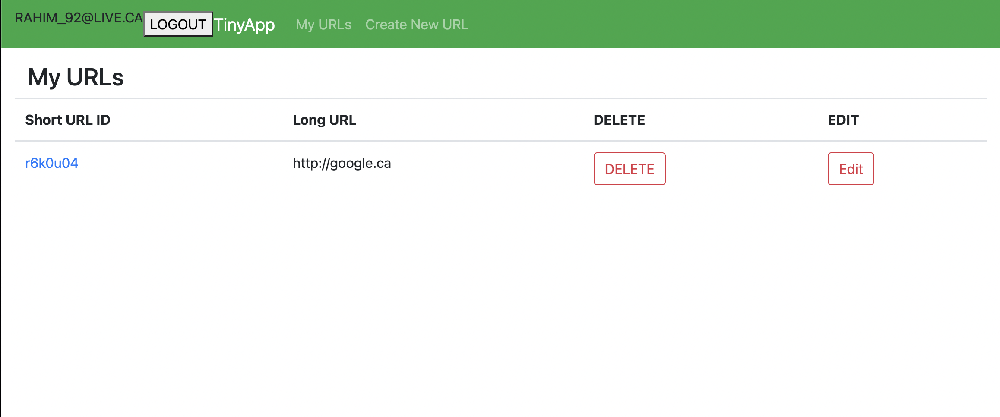

# TinyApp Project

TinyApp is a full stack web application built with Node and Express that allows users to shorten long URLs (à la bit.ly).

## Final Product

# Images

This is my Create Tiny URL Page!
 This is my Created Tiny Url Page! 

This is the page of the URL Data base!

This is the Login page!!

This is the Register page!

## Dependencies

- Node.js
- Express
- EJS
- bcryptjs
- cookie-session

## Getting Started

- Install all dependencies (using the `npm install` command).
- Run the development web server using the `npm start` command.
` 